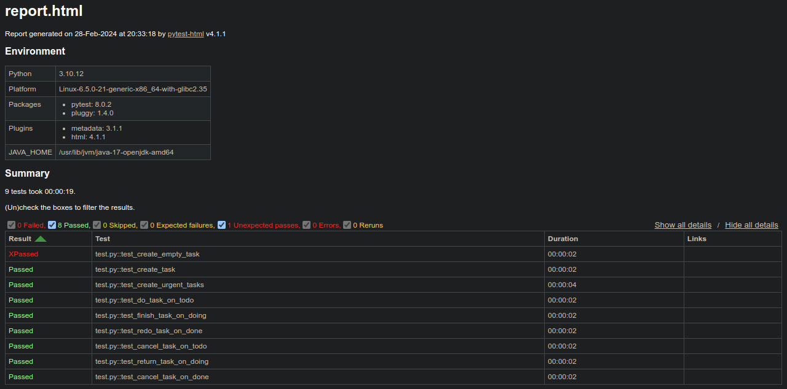

# python-selenium
This repo contains automation with selenium and python.

## Requirements
Ideally, use Python 3.8+ and install the following
``` bash
pip install selenium
```
As of the moment I am making this, the latest version of Selenium package is **4.18.1**. I always recommend installing the latest version and adapt the code if something is broken / deprecated.

## The page
The site being automated is [this Todo List](https://selenium.dunossauro.live/todo_list.html). Which is some kind of kanban board where one can create a task and move it between 3 columns (todo, doing, done).

> Tasks marked 'urgent' when created,  should be on top of others in the 'todo' column.

- The task fieldset has title, description and an 'urgent' checkbox.
- The tasks in 'todo' column have a title, description and two buttons ('cancel' and 'do')
  - Clicking 'cancel' will delete the task
  - Clicking  'do' will move the task to 'doing' column
- The tasks in 'doing' column have a title, description and two buttons ('back' and 'done')
  - Clicking 'back' will return the task to 'todo' column
  - Clicking  'done' will move the task to 'done' column
- The tasks in 'done' column have a 'redo' button
  - Clicking 'redo' will send the task back to 'todo' column

I used the page-object model (POM) to abstract as much as possible. Most of Selenium-related code is in the ```page_objects``` or ```pages``` packages, except for the webdriver fixture that is required to run the tests.

## Running the tests
Pytest is my preferred testing framework, which is why I used it for the tests. In addition, I used pytest-html to generate a friendly report. Installing them is as simple as
```bash
pip install pytest pytest-html
```

To run, do
```bash
pytest --html=report.html --self-contained-html test.py
```

The  ```--self-contained-html``` argument adds the styling to the html file. Without it, CSS would be saved on a different directory and sharing the report could be problematic.

This is how the report should look like


